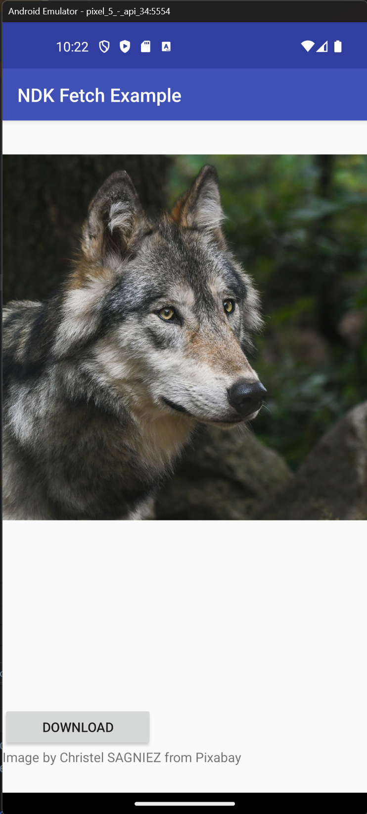

# Android NDK Fetch Example

---
Checklist:
- [X] Working HTTP
- [X] Working HTTPS **(unsafe: SSL certificate is ignored for now...)**
- [ ] Test on all architectures
---

Android project using C++ and libcurl to fetch remote content.

Posted on Github as online documentation is very sparse on this topic.

**UPDATE: After making this repo, I came across an offical Android NDK example named curl-ssl: 
https://github.com/android/ndk-samples/tree/3a18f1d90149d9959bff34e7ba2cdc927a901d58/prefab/curl-ssl**

## Screenshots

Image by <a href="https://pixabay.com/users/christels-3741991/?utm_source=link-attribution&utm_medium=referral&utm_campaign=image&utm_content=2878678">Christel SAGNIEZ</a> from <a href="https://pixabay.com//?utm_source=link-attribution&utm_medium=referral&utm_campaign=image&utm_content=2878678">Pixabay</a>

## Resources
- Prebuilt curl libraries: https://github.com/gustavogenovese/curl-android-ios 
- Prebuilt openssl libraries: https://teskalabs.com/blog/openssl-binary-distribution-for-developers-static-library
